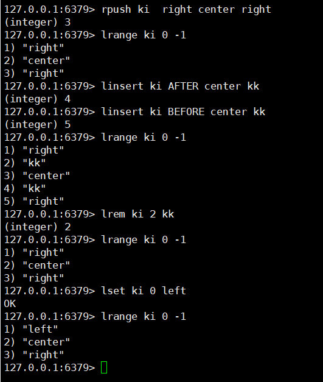

# 简介

list是单键多值的

底层使用的是一个quicklist双向链表：

- 在两端操作效率高，中间效率较低，
- 在查询上效率较低（元素储存分散，无下标，需要遍历），增删改查中效率较高（只需要在相应位置插入下标，不需要移动元素）
- quicklist链表
  - 会先创建一个连续内存空间的压缩链表ziplist，存储较少的元素。
  - 当元素较多时，会再创建一个ziplist，通过链表的形式连接在一起，形成quicklist链表
  - 这种结构不会出现太多的冗余，保证了快速的插入删除性能

# 相关命令

## lpush/rpush \<key> \<value1> \<value2> .....

- 功能：向指定键名的数组左边/右边依次添加元素
- `lpush`：左边插入
- `rpush`：右边插入
- `key`：键名
- `valuex`：链表元素值

## lpop/rpop \<key>

- 功能：向向指定键名的数组左边/右边吐出（不是返回）一个数组值
- `lpop`：最左侧返回
- `rpop` ：最右侧返回
- `key`：键名
- 注意，吐出指的是将值返回并删除，也就是链表不会存在返回值

## 上述命令示例

## rpoplpush/lpoprpush \<key1> \<key2>

- 功能：在key1右边/左边吐出一个元素，插到key2右边/左边
- 注意：命令不可写为rpoprpush/lpoplpush 
- `keyx`：键名

## lmove \<key1> \<key2> left|right left|right 

- 功能：在key1右边/左边吐出一个元素，插到key2左边/右边
- 注意：与`rpoplpush/lpoprpush`功能相同，但新版（6.2.0之后）已弃用`rpoplpush/lpoprpush`改为了`lomve `

## lrange \<key> \<start> \<end>

- 功能：从左到右，从起始点到终止点返回key的所有值
- `key`：键名
- `start`：起始点
- `end`：终止点
- 注意：起始点可以使用负数，负数代表从右边开始的索引，`lrange <key> 0 -1`可以遍历所有元素
- 注意：不能从右到左开始遍历，会出错

## lindex \<key> \<index>

- 功能：从0开始，从左到右按照索引下标查找元素
- key：键名
- index：索引值

## llen \<key>

- 功能：获取链表长度
- key：键名

## 上述命令演示示例

## linsert \<key> BEFORE|AFTER \<pivot> \<value>

- 功能：指定`key`的`pivot`元素前（`before`）/后（`after`），添加`value`元素
- `key`：键名
- `pivot`：被插入元素
- `value`：插入元素
- `BEFORE|AFTER`：插入元素位于插入元素的左边/右边

## lrem \<key> \<count> \<value>

- 功能：在指定`key`中，删除指定数量（`count`）的`value`值
- `key`：键名
- `count`：删除数量
- `value`：删除的值

## lset \<key> \<index> \<value>

- 功能：在指定`key`中，从0开始，从左到右，替换指定位置（`index`）的值为指定值（`value`）
- `key`：键名
- `index`：索引值
- `value`：替换值

## 上述命令示例

